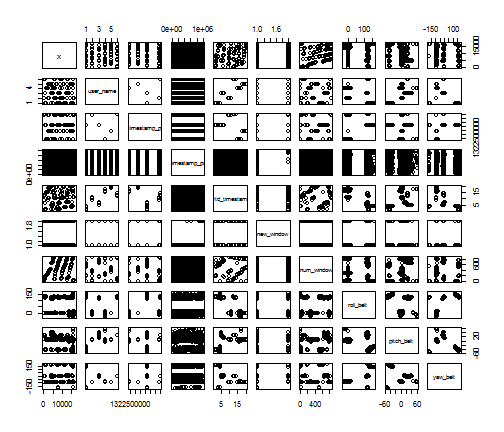
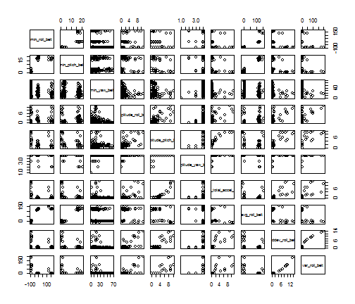

Assessment R Markdown
========================================================

## This is a R markdown for the Assessment (Peer Reviewed) for the Practical Machine Learning Course from the John Hopkinson University

### **Author** - Mohit Sewak - *mohitsewak@gmail.com*

#### Built on R version 2.15.2, using R Studio Version 0.98.507, Posted on GitHub Repository [mohitsewak/RMachineLearning] (http://mohitsewak.github.io/RMachineLearinng/) using gw-pages.


Loading required libraries (Results Hidden, Warnings OFF, Messages OFF)


```r
library(lattice)
library(ggplot2)
library(graphics)
library(Hmisc)
library(e1071)
library(caret)
```


Reading (& caching) Files.


```r
training = read.csv("pml-training.csv")
testing = read.csv("pml-testing.csv")
```


Creating summary and viewing the top few records, and seeing paired scatter plots in the training file (Results Hidden, Output Cached).


```r
summary(training)
head(training)
```


Since the data size, and number of feature vectors are huge, so reducing both the data size for plots and also the number of columns in a set of paired visualization


```r
plot(training)
```

```
## Error: figure margins too large
```

```r
pairs(training[1:10000, 1:10])
```

 

```r
pairs(training[1:10000, 11:20])
```

 

```r
pairs(training[1:10000, 21:30])
```

 


Since most of the columns have no data, or predictive power, it might not be conducive to use them as-is.
<p> Conducting the following prepocessing operations:</p>
- Removing Near Zero Value Predictors
- Principal Component Axis (PCA) rotation to optimize/ reduce dimensions in the data set 
- (Nt: Variable 160 = target variable named "classe"")


```r
nzv <- nearZeroVar(training[, -160])
dim(training)
```

```
## [1] 19622   160
```

```r
nzv_training <- training[, -nzv]
dim(nzv_training)
```

```
## [1] 19622   100
```


Finding numric variables, as PCA can be applied only on numeric variables


```r
numericvars <- NULL
numericvarsid <- NULL

non_numericvars <- NULL
non_numericvarsid <- NULL

id <- 0L

for (Var in names(nzv_training)) {
    
    id <- id + 1
    
    if (class(nzv_training[, Var]) == "integer" | class(nzv_training[, Var]) == 
        "numeric") {
        numericvars <- c(numericvars, Var)
        numericvarsid <- c(numericvarsid, id)
    } else {
        non_numericvars <- c(non_numericvars, Var)
        non_numericvarsid <- c(non_numericvarsid, id)
    }
}

summary(numericvars)
```

```
##    Length     Class      Mode 
##        97 character character
```

```r
numericvarsid
```

```
##  [1]  1  3  4  6  7  8  9 10 11 12 13 14 15 16 17 18 19 20 21 22 23 24 25
## [24] 26 27 28 29 30 31 32 33 34 35 36 37 38 39 40 41 42 43 44 45 46 47 48
## [47] 49 50 51 52 53 54 55 56 57 58 59 60 61 62 63 64 65 66 67 68 69 70 71
## [70] 72 73 74 75 76 77 78 79 80 81 82 83 84 85 86 87 88 89 90 91 92 93 94
## [93] 95 96 97 98 99
```


Conducting PCA on Numeric Variables


```r

numPCATrain <- preProcess(nzv_training[, numericvarsid], method = "pca", thresh = 0.8)
numPCATrain
```

```
## 
## Call:
## preProcess.default(x = nzv_training[, numericvarsid], method =
##  "pca", thresh = 0.8)
## 
## Created from 406 samples and 97 variables
## Pre-processing: principal component signal extraction, scaled, centered 
## 
## PCA needed 17 components to capture 80 percent of the variance
```


