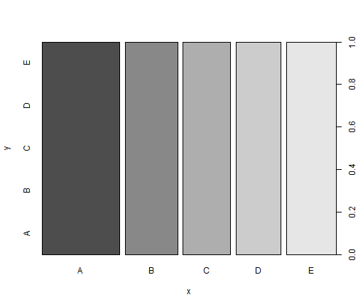

<!-- background: #b2cdb7 -->
<!-- color: #fff -->
<!-- font: din -->

Project 1 - R Markdown
========================================================


### This is for the (Peer Reviewed) Project Assessment for the Practical Machine Learning Course from the John Hopkinson University

#### **Author** - Mohit Sewak - *mohitsewak@gmail.com*

##### Built on R version 2.15.2, using R Studio Version 0.98.507, Posted on GitHub Repository [mohitsewak/RMachineLearning] (http://mohitsewak.github.io/RMachineLearinng/) using gw-pages.


Loading required libraries (Results Hidden, Warnings OFF, Messages OFF), and setting seed for reproducibility.


```r
library(caret)
library(rpart)
library(randomForest)
set.seed(1234)
```

Clearing existing objects, Reading (& caching) Files, and making training and validation data sets.


```r
rm(list=ls())
trainingCSV = read.csv("pml-training.csv")
inTrain <- createDataPartition(trainingCSV$classe, p=0.60, list=FALSE)
training <- trainingCSV[inTrain, ]
validation <- trainingCSV[-inTrain, ]
```

Creating summary and viewing the top few records, and seeing paired scatter plots in the training file (Results Hidden, Output Cached).


```r
summary(training)
head(training)
```

Trying to explore the data, esp the relations between variables. 

<p></p>

<p> Since the number of features are huge, so most of the comprehensive plot based visualizations will break.</p>

<p></p>

<p>There we may try to see multiple subsetted plot (as some examples given), or better still, see the tabular correlation matrix of the ones which are highly correlated.</p>


```r
plot(training)
```

```
## Error: figure margins too large
```

```r
pairs(training[1:10000,1:10])
```

 

```r
pairs(training[1:10000,11:20])
```

 

```r
pairs(training[1:10000,21:30])
```

 

Since most of the columns have no data, or predictive power, it might not be conducive to use them as-is. Therefore filtering out fields with a lot of (more than 60%) null values.


```r
goodVar<-c((colSums(is.na(training[,-160])) >= 0.4*nrow(training)),160)
training<-training[,goodVar]
dim(training)
```

```
## [1] 11776    68
```

```r
validation<-validation[,goodVar]
dim(validation)
```

```
## [1] 7846   68
```

```r
testing<-testing[,goodVar]

training<-training[complete.cases(training),]
dim(training)
```

```
## [1] 11776    68
```

Training the model (RandomForest) on the training data set.


```r
model <- randomForest(classe~.,data=training)
print(model)
```

```
## 
## Call:
##  randomForest(formula = classe ~ ., data = training) 
##                Type of random forest: classification
##                      Number of trees: 500
## No. of variables tried at each split: 8
## 
##         OOB estimate of  error rate: 0.01%
## Confusion matrix:
##      A    B    C    D    E class.error
## A 3348    0    0    0    0   0.0000000
## B    1 2278    0    0    0   0.0004388
## C    0    0 2054    0    0   0.0000000
## D    0    0    0 1930    0   0.0000000
## E    0    0    0    0 2165   0.0000000
```

```r
head(importance(model))
```

```
##     MeanDecreaseGini
## X              130.2
## X.1            158.0
## X.2            145.2
## X.3            163.0
## X.4            156.5
## X.5            141.8
```

Evaluating the model on the evaluation dataset.


```r
plot(predict(model,newdata=validation[,-ncol(validation)]),validation$classe)
```

 

```r
confusionMatrix(predict(model,newdata=validation[,-ncol(validation)]),validation$classe)
```

```
## Confusion Matrix and Statistics
## 
##           Reference
## Prediction    A    B    C    D    E
##          A 2232    1    0    0    0
##          B    0 1517    1    0    0
##          C    0    0 1367    1    0
##          D    0    0    0 1285    1
##          E    0    0    0    0 1441
## 
## Overall Statistics
##                                     
##                Accuracy : 0.999     
##                  95% CI : (0.999, 1)
##     No Information Rate : 0.284     
##     P-Value [Acc > NIR] : <2e-16    
##                                     
##                   Kappa : 0.999     
##  Mcnemar's Test P-Value : NA        
## 
## Statistics by Class:
## 
##                      Class: A Class: B Class: C Class: D Class: E
## Sensitivity             1.000    0.999    0.999    0.999    0.999
## Specificity             1.000    1.000    1.000    1.000    1.000
## Pos Pred Value          1.000    0.999    0.999    0.999    1.000
## Neg Pred Value          1.000    1.000    1.000    1.000    1.000
## Prevalence              0.284    0.193    0.174    0.164    0.184
## Detection Rate          0.284    0.193    0.174    0.164    0.184
## Detection Prevalence    0.285    0.193    0.174    0.164    0.184
## Balanced Accuracy       1.000    1.000    1.000    1.000    1.000
```

```r
accurate<-c(as.numeric(predict(model,newdata=validation[,-ncol(validation)])==validation$classe))
accuracy<-sum(accurate)*100/nrow(validation)
message("Model Accuracy as tested over Validation set = " , format(round(accuracy, 2), nsmall = 2), "%")
```

```
## Model Accuracy as tested over Validation set = 99.95%
```

Predicting the new values in the testing csv provided.


```r
testing =  read.csv("pml-testing.csv")
dim(testing)
```

```
## [1]  20 160
```

```r
testing<-testing[,goodVar]
dim(testing)
```

```
## [1] 20 68
```

```r
predictions<-predict(model,newdata=testing)
predictions
```

```
##  1  2  3  4  5  6  7  8  9 10 11 12 13 14 15 16 17 18 19 20 
##  A  A  A  A  A  A  A  A  A  A  A  A  A  A  A  A  A  A  A  A 
## Levels: A B C D E
```

## Thank You for the Evaluation!!!
### Best Regards,
#### Mohit Sewak
<p></p>
